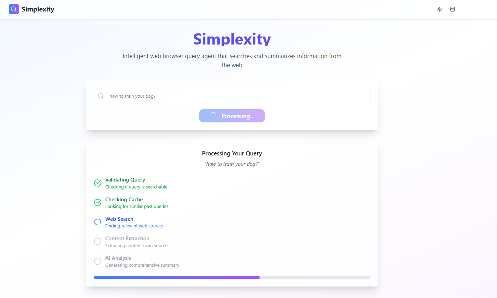
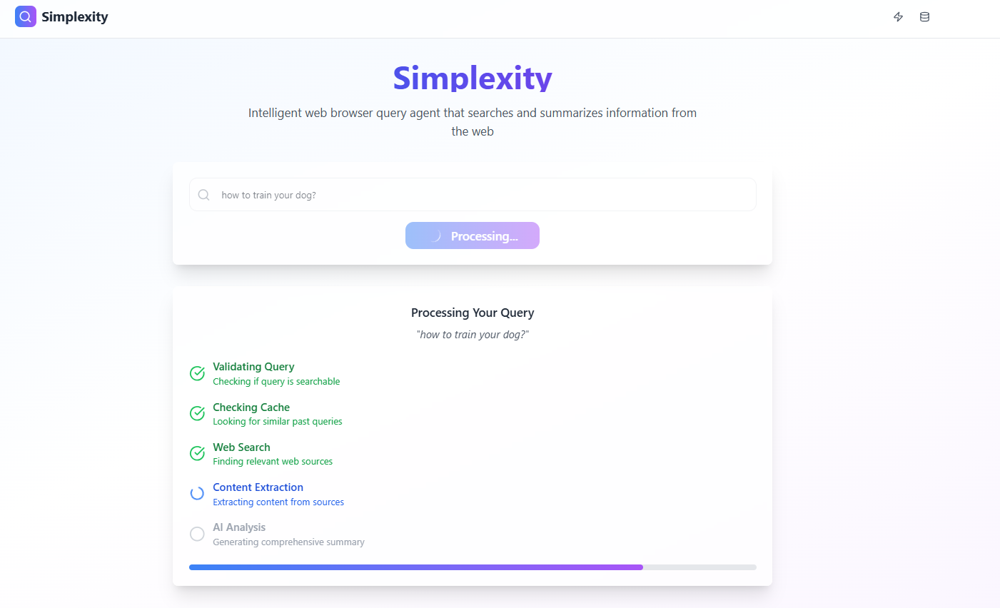
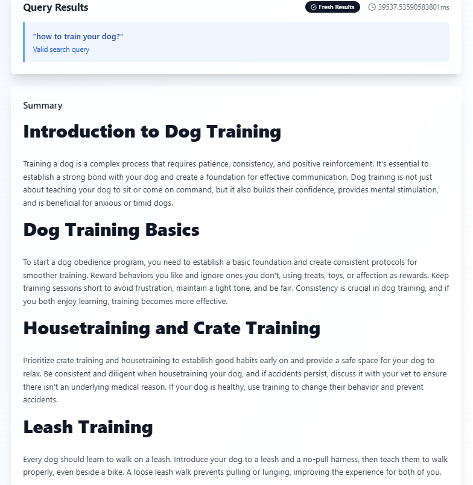
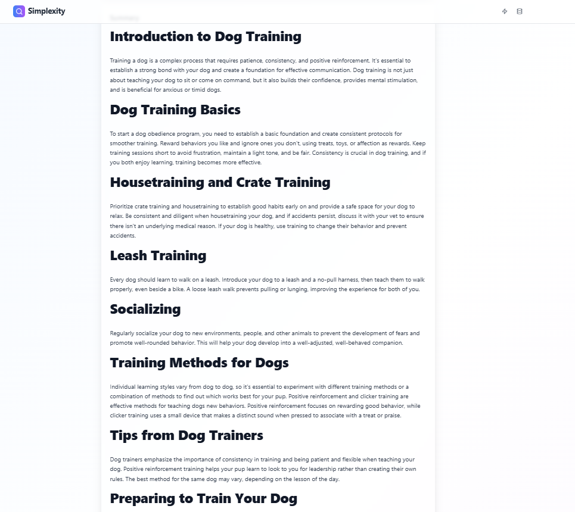
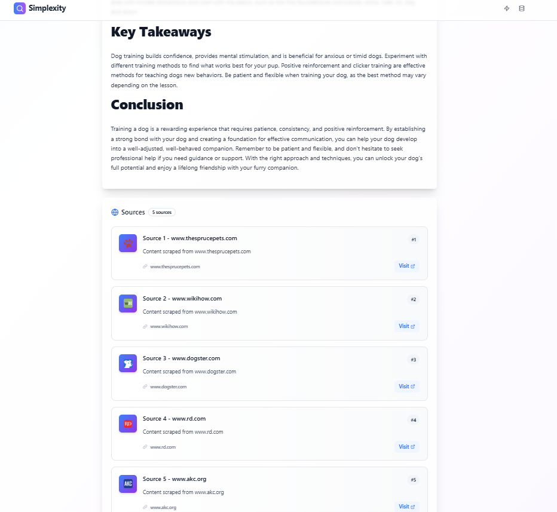
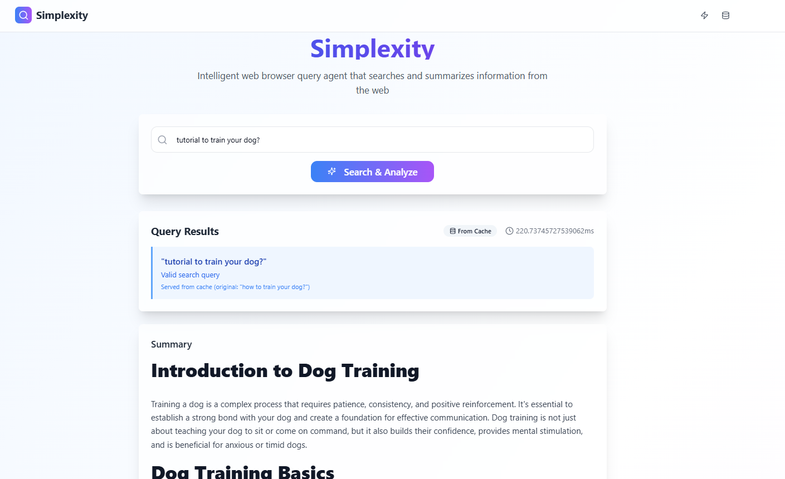

# Simplexity Query Agent

An intelligent web query agent that validates, searches, scrapes, and summarizes information from the web, with caching for fast repeated queries. 

## Screenshots of the Functionality

*Real-time updates to the frontend for more responsive experience*

*Content displayed in markdown*

*Knowledge sources displayed*

*Cache hit for similar queries*

---

## Features
- **Query Validation**: Filters out unsupported or irrelevant queries
- **Semantic Caching**: Use cached answers for repeated or similar queries.
- **Web Search & Scraping**: Finds and extracts content from top 5 results from duckduckgo using headless browser automation.
- **Focused Content Extractor**: Extracts relevant content for the summarizer from scraped content.
- **AI Summarization**: Generates concise, relevant answers using GROQ LLMs.
- **Modular Design**: Each stage is a separate, testable module for easy maintenance and extension.

---

## 🏗️ Architecture

## 💻 Tech Stack

- **Backend**: FastAPI
- **Frontend**: React, TypeScript, Material-UI
- **Vector DB**: ChromaDB
- **Web Scraping**: Requests, Selenium, BeautifulSoup
- **LLM**: GROQ LLMs (for summarization)
- **Styling**: CSS Modules, TailwindCSS

---

## How it works❓

The agent follows the following workflow to process user queries and return summarized results.

### 1. **User Enters Query**
The user inputs a search query, initiating the process.

### 2. **Query Validation**
Once the query is entered, it is validated:
- If the query is **valid**, the search process continues.
- If the query is **invalid** (e.g., actionable input like "walk my dog", "set alarm for 6pm", gibberish), the system doesn't run the search pipeline.
- Additionally, the system checks whether the query is **time-sensitive** (e.g., specific event times or actions). Time-sensitive queries will not be cached to avoid outdated information being served.

### 3. **Check Cache for Similar Queries**
If the query is valid, the system checks if a **similar query** already exists in the cache. It compares the new query with the top 3 most similar queries using a similarity score.
- If a similar query is found, the cached result is returned immediately.
- If no similar query is found, the search process proceeds.

### 4. **Search Using DuckDuckGo API**
If no cached result is found, the system proceeds to **search for the query** using the DuckDuckGo API. The top 5 search results are retrieved for further processing.

### 5. **Scrape Content Using Selenium**
The agent uses **headless browser automation with Selenium** to scrape the content from the top 5 search results retrieved from DuckDuckGo.
- Selenium allows the agent to interact with the pages like a real user, enabling it to scrape dynamic content efficiently.

### 6. **Condense and Extract Focused Content**
Once the content is scraped, it is processed to extract the most **focused and relevant** parts related to the user’s query. The content is cleaned up to remove unnecessary information and noise.

### 7. **Summarization**
The extracted content is passed to a **summarizer** (e.g., GPT or BERT) to condense the relevant information into a concise and readable summary.

### 8. **Cache and Display**
The final summarized content is then **stored in the cache** for future similar queries. It is also displayed on the **frontend** in **Markdown format**, allowing for easy rendering and display.

---